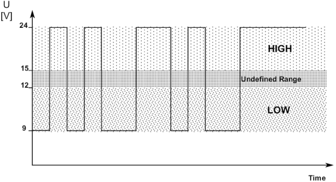
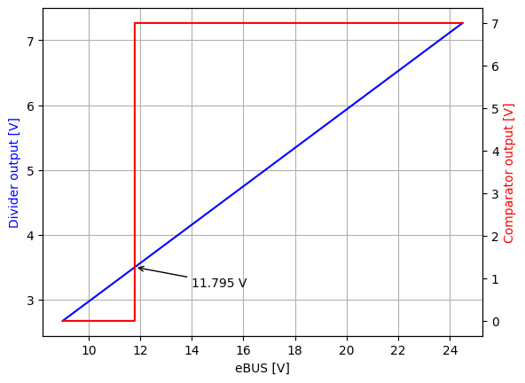

eBUS on Raspberry Pi
=====================

The goal of this article is to describe my latest battle against eBUS protocol on Raspberry Pi. Shortly - eBUS is an open communication protocol used primarily for controlling heating in home. In the simplest scenario the bus consists of two devices: heater, and a room controller with a temperature sensor. I wanted to add a Raspberry Pi Zero to the bus to control the heating remotely, and also to monitor the current temperature and other heating parameters. I also had a plan to use one of Nordic BLE chips for this, but I wanted to start from something simpler; and that was a good decision.

I spent a lot of time, nerves and solder to figure out how to properly participate on the eBUS, so I can hear other devices, and what's even more important - other devices can hear me. These notes are for future me, and also for other admirers of home automation.

Shortly about eBUS
------------------

I'm not going to describe the whole protocol, because it's been already done in the official documentation of `eBUS`_. It's just a short introduction for the sake of clarity.

**eBUS** is a multi-master, multi-slave serial protocol. Data is transmitted over two wires, exactly the same as it is done for UART: one start bit, 8 bits of data, and one stop bit. Everything happens at 2400 baud. Does it mean the RPi can be simply connected to the bus by its RX and TX pins? Yes, but not that simply, it could fry the board because voltages on the bus can easily reach 24 volts.

The voltage level difference is not the only obstacle. "Multi-master UART" does not sound legitimately, right? It clearly needs some software support to accomplish the communication between multiple devices, and some sort of arbitration in case multiple devices start transmitting data at the same time. Besides, eBUS does not have separate wires for transmission and reception, the data is simply transferred through one wire, while the other wire is a ground.

Thankfully some of the above problems are already solved. `ebusd`_ is a Linux daemon which takes care of arbitration and proper packet transmission over eBUS. So as long as RPi is correctly attached to the bus, ebusd can do its job. Having the communication part covered, I can focus on the harder part - microcontroller interface/adapter.

Microcontroller interface
-------------------------

   Microcontroller interface schematic

The official documentation of `eBUS` includes a couple of useful schematics. The one that I found the most interesting is on the page **25**, it shows a connection of an arbitrary microcontroller to eBUS. At first it might be overwhelming, at least it was for me because I'm not an expert, but it becomes much clearer with a time. Let's divide to logical parts and understand.

Interchangeable connectors
++++++++++++++++++++++++++

   eBUS input port

eBUS devices should be designed the way they can be connected to the bus without worrying about a polarity of the connectors. This is primarily due to practical reasons, so shops can sell room controllers without multimeters attached. Such behaviour can be easily achieved by having a rectifier bridge on eBUS input. On the schematic this is done with four **LL4148** diodes.

Low-voltage output
++++++++++++++++++

   Voltage regulation

Voltage levels on the bus can vary chiefly. The highest the bus can go is 24 volts, but devices are allowed to use lower values. As shown on the chart below, anything between 15 and 24 volts is considered a high state, while anything between 9 and 12 volts is a low state. That means the voltage can swing from 9 to 24 volts. Since it's impossible to power anything with such unstable voltage, the schematic includes a transistor connected in an emitter-follower topology which behaves like a simple voltage regulator.

.. _voltage levels:

   eBUS Voltage Levels

The Zener diode at the base junction has value of 7.5 V, that means the output voltage at the emitter junction will be about 6.9 V (7.5 V - 0.6 V of PN junction). That regulated voltage will power other components on the board. For the simplicity I will assume it's 7 volts and I will use that value through the rest of the article.

It's possible to replace this block with an ordinary voltage regulator like LM7805. I didn't do it for my schematic, but I will for the second revision.

Level conversion
++++++++++++++++

The level conversion is done by two op-amp comparators (usually enclosed within a single integrated circuit package). One comparator is responsible for receiving signals, the other one for transmitting them. I'm pretty sure the comparator for transmission is not as that important as the one for reception.

The comparators are powered from the 7 V source. The important thing is that they are **rail-to-rail op-amps**, that means their outputs can output a full span of voltages, starting from GND and finishing at VDD (7 V in this case).

Reception
*********

.. _reception comparator:

   Reception block

This is a classical comparator circuit. The inverting input of the op-amp is connected to +7 V through a voltage divider formed from two 100 kΩ resistors. That means the voltage on the inverting input is something about 3.5 V.

The non-inverting input is attached to a voltage divider too, but it's powered from the eBUS output. Additionally, it has a 2 MΩ feedback resistor to maintain a stable output; it can be ignored in the following considerations.

The principle of work is: if voltage of the bus (after reduction by the voltage divider) is 3,5 V or less, then op-amp should output 0 V. In other case, the op-amp should output 7 V. The chart below shows how the voltages relate to each other. The bus voltage which triggers transition of op-amp is about 11.795 V, which is compliant with the bus levels given in :numref:`voltage levels`.

   Relationship of voltages on reception side

What happens with the voltage outputted from the op-amp will be covered later.

Transmission
************

.. _transmission comparator:

   Transmission block

The goal of the transmission block is to drop bus voltage when microcontroller wants to send 0, and maintain an idle voltage when it wants to send 1. This is accomplished by connecting/disconnecting the eBUS line to ground through a Zener diode. When microcontroller wants to send 0, it connects the diode, when it wants to send 1, it disconnects the diode. 

The diode is disconnected when the op-amp outputs 0 V. The only situation in which comparator can produce 0 volts is when the inverting input is at higher or at the same potential as the non-inverting input. On the schematic the non-inverting input is fixed at 3.5 V (thanks to the voltage divider), whereas inverting input depends on what TX wants to send. Now, when TX outputs 0 V the transistor is in cut-off mode, that means the line is pulled-up by a 10 kΩ resistor to 7.5 V. Since the non-inverting input is now much smaller than the inverting input, the op-amp outputs 0 V. When op-amp outputs 0 V the diode is **not connected**, ergo the bus level is not affected (high level). Is that correct? Yes, it's perfectly fine, it will be explained later.

In order to connect the diode TX must change to a high level which saturates the transistor, and it connects the inverting line to ground. Now the non-inverting input is at a higher potential, which means the op-amp will drive the output with its maximum which is 7.5 V, this in turn connects the bus to ground through a Zener diode, whereby dropping the bus voltage to 7.5 V (low level).

Electric separation
+++++++++++++++++++

This section is strongly related to "Level conversion". While the previous described what happens on the eBUS side, this section describes the microcontroller part.

Both worlds, high voltage eBUS, and low voltage TTL, talk to each other by means of optocouplers. This galvanic separation protects the fragile microcontroller from potentially harmful voltages appearing on the bus. The optocouplers on the schematic appear as transistors with diodes attached to their bases. 

Transmission
************

   Electric separation of TX line

When TXD outputs 1, then there is no current flow between +5 V and TXD because they are on the same potential, as a result the diode is not emitting a light. When there is no light received on the left photodiode, the transistor's base is pulled down to the ground by a 2 MΩ resistor which effectively puts the transistor into a cut-off state. That means the TX is pulled down to the ground by a 20 kΩ resistor. Where TX connects to can be seen on the :numref:`transmission comparator`.

When TXD outputs 0, then current flows between +5 V and TXD, hence the diode emits a light. This generates current flow on the receiving photodiode which turns on the transistor, and opens a way for 7.5 V to the TX.

Reception
*********

   Electric separation of RX line

The RX line on the left is connected to a comparator, as can be seen on the :numref:`reception comparator`, thus state of the optocoupler's diode depends on the state of the comparator. When the comparator outputs a high state, then the diode is not lit. As a consequence, no current flows through the photodiode on the opposite side, the transistor is in a cut-off state, and the other transistor is turned off too. That means the RX line of a microcontroller is tied to a +5 V through a 22k resistor, which is read by the microcontroller as logical 1.

When the comparator outputs a low state (sinks current), the diode starts emitting light, which turns on both transistors, so the RX line of the microcontroller is tied to a ground - logical 0.

Issues
------

Now, when the schematic is clear, it's easier to spot a bunch of issues and possible pitfalls. Although it's electronically correct, practically it might not work as expected, at least not for everyone.

5 V interface
+++++++++++++

There's nothing wrong in feeding popular microcontrollers with 5 volts, but given that this article is about Raspberry, 5 volts present on the microcontroller interface is not acceptable. Thankfully it's easy to fix, it requires only a simple math to match new resistor values.

.. important:: Whenever there is a reference to an electronic part below, it designates one of the parts found on the right-hand side of the schematic where the microcontroller interface is.

Let's start with 3,22 kΩ resistor which limits current fed to the optocoupler. For 5 volts the maximum current is about 1,6 mA. For 3,3 volts the resistor has to be something about 2,06 kΩ, so I picked 2 kΩ.

The next is the 22,1 kΩ resistor which is a pull-up for the RXD line. For 5 volts the current is about 226 μA, so for 3,3 volts the resistor has to be near 14,6 kΩ. I picked 14,7 kΩ.

The resistor which is connected to a base of BC817 has 1 kΩ, that means it supply the base with 5 mA. For 3,3 volts the resistor has to be replaced with 660 Ω, so I picked 665 Ω. 

The last one is the 10 kΩ resistor pulling down the base of the transistor to ground. For 3,3 volts I replaced it with 6,65 kΩ.

EBUS low signal is too low
++++++++++++++++++++++++++

The :numref:`voltage levels` clearly says that the lowest voltage of EBUS is 9 V. What happens below that value is a lottery. So, why is the 7V5 Zener diode used for dropping the bus voltage when transmitting a low level? In my case that value was definitely too low, when I tried to send something the bus just hang for a while in an indeterminate state. For me, a 9V5 Zener worked much better.

Too broad voltage levels
++++++++++++++++++++++++

This is probably the 

----

.. target-notes::

.. _`eBUS`: https://ebus-wiki.org/lib/exe/fetch.php/ebus/spec_prot_12_v1_3_1_e.pdf
.. _`ebusd`: https://github.com/john30/ebusd
